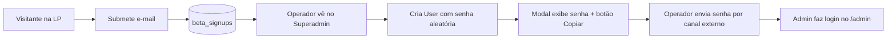
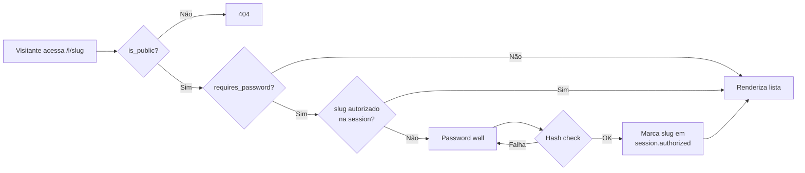

# PRD — PlayTask

| Campo        | Valor                                       |
| ------------ | ------------------------------------------- |
| Produto      | PlayTask                                    |
| Versão       | 1.0 (MVP)                                   |
| Data         | 2026-05-12                                  |
| Status       | Draft — pronto para planejamento de tarefas |
| Autor        | Marcelo Guerra                              |
| Stack        | Laravel 13 · Filament 5 · Pest 4 · Reverb 1 |
| Distribuição | SaaS — somente por convite (sem self-serve) |

---

## 1. Resumo executivo

PlayTask é um SaaS leve de **todo lists colaborativas em tempo real**, distribuído **somente por convite** durante o Beta. Cada usuário convidado gerencia suas próprias listas em um painel administrativo Filament, podendo torná-las públicas (com URL via slug), protegê-las por senha e/ou marcá-las como somente leitura. As listas públicas são consumidas em um Guest Panel sem autenticação, com sincronização em tempo real via Laravel Reverb tanto para o dono quanto para os visitantes.

A operação SaaS é feita por um Superadmin Panel separado, onde os operadores enxergam os e-mails inscritos no Beta na landing page e criam contas manualmente com senha aleatória copiável (não há envio automático de e-mail nem fluxo público de cadastro).

---

## 2. Problema e contexto

### 2.1. Problema

Ferramentas de todo list públicas modernas tendem a duas direções extremas: ou são produtos pessoais sem compartilhamento simples, ou são plataformas de produtividade complexas (Asana, ClickUp) com curva de aprendizado e custo desproporcionais para o caso de uso de "uma lista colaborativa rápida".

Falta um meio-termo: **um sistema que permita criar uma lista, compartilhar por link público (opcionalmente protegido por senha), e ver as alterações ao vivo**, sem que cada participante precise criar conta.

### 2.2. Por que agora

- Reverb (Laravel 13) tornou o broadcasting first-class e auto-hospedável, eliminando dependência de Pusher.
- Filament 5 entregou Schemas (form/infolist unificados), Actions centralizadas e arquitetura multi-painel madura.
- A combinação Filament + Livewire 4 + Reverb cobre o stack inteiro — admin, public e real-time — sem SPA paralela.

### 2.3. Estado atual

Não há código de produto ainda. O projeto está num Laravel 13 fresco com Filament 5, Pest, Reverb, Fortify e FluxUI instalados (ver `composer.json`, `package.json`, branch `main`).

> **Importante:** Fortify foi instalado por padrão do scaffold, mas **toda a autenticação será feita exclusivamente via Filament**. Fortify não será utilizado; suas rotas de auth serão desabilitadas. Sanctum também não será usado no MVP.

---

## 3. Usuários e personas

| Persona               | Quem é                                                       | O que faz no PlayTask                                                                                                                  |
| --------------------- | ------------------------------------------------------------ | -------------------------------------------------------------------------------------------------------------------------------------- |
| **Operador SaaS**     | Equipe interna (dono do produto)                             | Acessa o Superadmin Panel, vê inscritos do Beta, cria contas de Admin manualmente com senha aleatória, copia a senha para enviar fora. |
| **Admin (cliente)**   | Usuário convidado, faz parte do Beta privado                 | Faz login no Admin Panel, cria e gerencia suas todo lists, configura visibilidade, senha e readonly, acompanha em tempo real.          |
| **Visitante público** | Qualquer pessoa com o link de uma todo list pública          | Visualiza (e edita, se não-readonly) uma todo list pública via Guest Panel. Pode passar por password wall na primeira visita.          |
| **Inscrito no Beta**  | Visitante da LP que deixou o e-mail para receber convite     | Não tem acesso ao app. Apenas figura na lista de e-mails do Superadmin Panel.                                                          |

---

## 4. Visão da solução

Três painéis Filament 5 separados, com o mesmo domínio Eloquent compartilhado e broadcasting unificado via Reverb:

```mermaid
graph TB
    subgraph Browser
        LP[Landing Page<br/>Guest Panel /]
        PUB[P&aacute;gina P&uacute;blica<br/>Guest Panel /l/&#123;slug&#125;]
        ADM[Admin Panel /admin]
        SUP[Superadmin Panel /superadmin]
    end

    subgraph Backend["Laravel 13 + Filament 5"]
        AUTHF[Filament Auth<br/>guards: admin, superadmin]
        LIVE[Livewire 4 Components]
        DOM[Eloquent Models<br/>User · TodoList · TodoItem · BetaSignup]
        BCAST[Broadcast Events<br/>TodoListUpdated · TodoItemUpdated]
    end

    subgraph Realtime["Reverb (WebSocket)"]
        REVERB[Reverb Server :8080]
    end

    DB[(PostgreSQL/MySQL)]
    ECHO[Laravel Echo Client]

    LP --> LIVE
    PUB --> LIVE
    ADM --> AUTHF --> LIVE
    SUP --> AUTHF --> LIVE
    LIVE --> DOM --> DB
    LIVE --> BCAST --> REVERB
    REVERB --> ECHO
    ECHO --> PUB
    ECHO --> ADM
```



---

## 5. Painéis e features

### 5.1. Guest Panel (`/`)

Painel Filament **sem autenticação**, responsável por:

- **Landing Page (LP)**
  - Hero do produto, descrição de funcionalidades, prova social (placeholder no MVP).
  - **Formulário de inscrição no Beta**: apenas e-mail. Single opt-in (armazena no banco sem confirmação por e-mail). Mensagem de sucesso inline.
  - Validação: e-mail válido, único na tabela `beta_signups`, rate-limit por IP (5/min).
- **Página pública de todo list** (`/l/{slug}`)
  - Renderiza a lista correspondente ao `slug` se `is_public = true`.
  - Se `requires_password = true` e a sessão atual não tem o slug autorizado, exibe **password wall** (componente Livewire) antes do conteúdo. Após acerto, marca o slug como autorizado em `session('public_lists_authorized', [])`.
  - Conteúdo:
    - Cabeçalho com título, badge "Read-only" se `is_readonly`.
    - Lista de items renderizada com componentes Filament (badges para complexidade, tags como chips, ícones de status pelos timestamps).
    - Se `is_readonly = false`: ações de criar/editar/marcar items abrem **slideover Filament** (mesma UX do Admin Panel).
  - Subscribe a canal Reverb da lista para receber updates ao vivo.

### 5.2. Admin Panel (`/admin`)

Painel Filament **autenticado** via Filament Auth (sem Fortify). Cada `User` só vê e gerencia seus próprios registros (`user_id = auth()->id()`).

#### 5.2.1. Login

- Página de login padrão do Filament 5 (`Filament\Auth\Pages\Login`), customizada apenas no branding (logo, cor primária).
- Sem registro público, sem recuperação de senha self-service no MVP (Operador SaaS gera nova senha pelo Superadmin Panel se necessário).

#### 5.2.2. Dashboard

Page padrão do painel (`/admin`) — exibe um `StatsOverviewWidget` (`AdminStats`) com:
- **Minhas listas** — total + breakdown (públicas / com senha).
- **Itens pendentes** — vs. concluídos.
- **Progresso geral** — % concluído + chart sparkline dos 7 últimos dias.

#### 5.2.3. Custom Page — "My Lists"

Página customizada Filament (`App\Filament\Admin\Pages\MyLists`), **sem ser um Resource tradicional**:

- **Layout em duas colunas** com componentes Filament:
  - **Sidebar esquerda**: lista das todo lists do usuário autenticado, **ordenadas por `created_at desc`** (mais recente primeiro). Item selecionado é destacado. Botão "+ Nova lista" no topo abre slideover de criação.
  - **Área principal**: conteúdo da lista selecionada — título editável inline, ação de configuração no topo, e a lista de items.
- **Items**:
  - Renderizados em ordem `created_at asc` (mais antigos primeiro).
  - Ações `create` e `edit` via **slideover Filament** (`->slideOver()`).
  - Toggle de "concluído" marca/desmarca `completed_at = now()` sem abrir slideover.
  - Ações secundárias: iniciar (`started_at = now()`), excluir.
- **Configuração da lista**: action no header da área principal abre slideover com schema:
  - Section "Visibilidade": `slug` (TextInput), `is_public` (Toggle), `is_readonly` (Toggle).
  - Section "Proteção": `requires_password` (Toggle), `password` (TextInput type=password, visível apenas se `requires_password = true`, gravado como hash bcrypt; campo vazio na edição = não altera).
- **Real-time**: sidebar e área principal escutam canais privados Reverb (ver §7).

> **Nota sobre Beta Signups:** os e-mails de inscritos **não aparecem no Admin Panel** — visíveis apenas no Superadmin Panel (operação SaaS). Veja §5.3.

### 5.3. Superadmin Panel (`/superadmin`)

Painel Filament autenticado, separado. Acesso liberado apenas para `users.is_superadmin = true`.

#### 5.3.1. Dashboard

Page padrão (`/superadmin`) com `SuperadminStats`:
- **Usuários** — total + ativos / superadmins.
- **Inscritos no Beta** — total + chart dos últimos 7 dias.
- **Listas públicas no ar** — gauge geral do uso.

#### 5.3.2. Resources

- **Resource "Beta Signups"** — listagem read-only dos e-mails de inscritos (única exposição no MVP).
- **Resource "Users"**
  - Lista usuários do Admin Panel.
  - Action `CreateAction` (header):
    1. Form com `name`, `email`.
    2. Gera **senha aleatória de 16 caracteres** (mix de letras maiúsculas/minúsculas, dígitos, símbolos seguros).
    3. Persiste `User` com hash da senha.
    4. Em vez de redirect, abre um **modal de sucesso** mostrando a senha em texto plano **uma única vez**, com **botão "Copiar"** (usando JS `navigator.clipboard`).
    5. **Não envia e-mail. Não envia notificação.** A senha não é exibida novamente em lugar nenhum.
  - Action "Regenerar senha" por linha: mesmo fluxo (gera nova senha, mostra com copy, descarta).
  - Ação "Desativar usuário" (`is_active = false`), bloqueando login sem deletar dados.

---

## 6. Modelo de dados

### 6.1. Tabelas

```mermaid
erDiagram
    USERS ||--o{ TODO_LISTS : owns
    TODO_LISTS ||--o{ TODO_ITEMS : has
    BETA_SIGNUPS

    USERS {
        id bigint PK
        name string
        email string UK
        password string
        is_active boolean
        timestamps
    }

    TODO_LISTS {
        id bigint PK
        user_id bigint FK
        title string
        slug string UK
        is_public boolean
        is_readonly boolean
        requires_password boolean
        password string nullable
        timestamps
    }

    TODO_ITEMS {
        id bigint PK
        todo_list_id bigint FK
        title string
        complexity string
        estimate string
        tags json
        started_at timestamp nullable
        completed_at timestamp nullable
        timestamps
    }

    BETA_SIGNUPS {
        id bigint PK
        email string UK
        ip string nullable
        user_agent string nullable
        timestamps
    }
```

### 6.2. Enums (não usar coluna ENUM no DB — string + cast)

Conforme convenção do projeto, todas as colunas abaixo são `string` no banco e recebem **cast para Enum PHP no Model**. Os Enums implementam `HasLabel`, `HasColor` e `HasIcon` (Filament).

```php
// app/Enums/Complexity.php
enum Complexity: string {
    case Low = 'low';
    case Medium = 'medium';
    case High = 'high';
}

// app/Enums/Estimate.php
enum Estimate: string {
    case Hours = 'hours';
    case Days = 'days';
    case Weeks = 'weeks';
}
```

Migrations usam `->default(Complexity::Low->value)` etc. Models usam `casts() => ['complexity' => Complexity::class, 'estimate' => Estimate::class, 'tags' => 'array']`.

### 6.3. Tags

- **Free-form globais por usuário**: cada `TodoItem.tags` é um JSON array de strings.
- Autocomplete do `TagsInput` consulta a união distinta de tags de todos os items de **todas** as listas do usuário autenticado (cache curto, ex.: 30s).
- Tags não têm tabela própria no MVP — extração futura é opcional.

### 6.4. Slugs

- Únicos na aplicação (`todo_lists.slug` com unique index).
- Geração automática a partir do título (`str()->slug()`) com sufixo numérico em colisão.
- Editável manualmente na configuração da lista (validação de unicidade ignorando o próprio registro).

### 6.5. Senha da lista pública

- Armazenada como **hash bcrypt** em `todo_lists.password`.
- Validação no Guest Panel via `Hash::check()`.
- Toggle `requires_password = false` apaga o hash (`password = null`).

---

## 7. Real-time (Reverb)

### 7.1. Canais

| Canal                                 | Tipo            | Quem assina                                                    |
| ------------------------------------- | --------------- | -------------------------------------------------------------- |
| `App.Models.User.{userId}.lists`      | Private         | Admin Panel — sidebar do dono (`MyLists` page).                |
| `todo-list.{listId}`                  | Private/Public  | Admin Panel (dono) **e** Guest Panel (visitantes da lista).    |

Canais de lista são **privados quando `is_public = false`** (apenas o dono autoriza em `routes/channels.php`) e **públicos quando `is_public = true`** (autorização aberta, com password wall validando no servidor antes de renderizar a página, não no canal).

### 7.2. Eventos broadcast

Todos implementam `ShouldBroadcast` e usam `ShouldBroadcastNow` quando houver baixa latência crítica (ações do usuário).

| Evento             | Disparado em                            | Canais                                                  | Payload                              |
| ------------------ | --------------------------------------- | ------------------------------------------------------- | ------------------------------------ |
| `TodoListCreated`  | Criação de lista                        | `App.Models.User.{ownerId}.lists`                       | `{ list_id, title, created_at }`     |
| `TodoListUpdated`  | Update de título / config               | `App.Models.User.{ownerId}.lists` + `todo-list.{id}`    | `{ list_id, changes }`               |
| `TodoListDeleted`  | Delete                                  | `App.Models.User.{ownerId}.lists` + `todo-list.{id}`    | `{ list_id }`                        |
| `TodoItemCreated`  | Criação de item                         | `todo-list.{listId}`                                    | `{ item_id, todo_list_id, ... }`     |
| `TodoItemUpdated`  | Update de campos / toggle conclusão     | `todo-list.{listId}`                                    | `{ item_id, changes }`               |
| `TodoItemDeleted`  | Delete                                  | `todo-list.{listId}`                                    | `{ item_id }`                        |

### 7.3. Cliente (Echo)

- `resources/js/echo.js` já está scaffoldado pela skill `echo-development`.
- Componentes Livewire ouvem via `#[On('echo:todo-list.{id},TodoItemUpdated')]` ou via JS hook em casos especiais.

---

## 8. Experiência do usuário (UX)

### 8.1. Fluxo: inscrição no Beta → criação manual de conta



### 8.2. Fluxo: visitante em lista pública com senha



### 8.3. Componentes Filament obrigatórios

- Todo form schema usa **`Section`** e/ou **`Fieldset`** quando há agrupamento lógico (configuração de lista, edição de item, criação de usuário no Superadmin).
- Listagens usam `Tables\Table` nativo (Beta Signups no Superadmin, Users no Superadmin).
- Slideover via `->slideOver()` nas actions de item e de configuração de lista.
- Badges, ícones e cores derivam dos Enums (`HasLabel`/`HasColor`/`HasIcon`).
- **Actions secundárias / por linha são icon-only** (`->iconButton()->tooltip(...)`) — Filament 5 enum `Size::Small` para compactação. Ações primárias (Nova lista, Novo item) mantêm label.
- **Custom Themes** publicados via `php artisan make:filament-theme {admin|superadmin}` e carregados nos PanelProviders com `->viteTheme(...)`. CSS dedicado em `resources/css/filament/{admin,superadmin}/theme.css` define utilidades reutilizáveis: `.playtask-list-item`, `.playtask-todo-row`, `.playtask-pill--{neutral,tag,success,warning}`, `.playtask-check`.

---

## 9. Arquitetura técnica

### 9.1. Stack confirmada

- **PHP 8.4**, **Laravel 13**, **Filament 5**, **Livewire 4**, **FluxUI Free 2**.
- **Reverb 1** (`config/reverb.php`, `config/broadcasting.php` já presentes).
- **Pest 4** para todos os testes.
- **Tailwind 4** + tema custom do Filament.
- **Banco**: SQLite em dev (default Laravel), PostgreSQL em produção.

### 9.2. Decisões arquiteturais

- **Sem Fortify**: rotas de Fortify desativadas no `FortifyServiceProvider` ou o package será removido do `composer.json` no MVP. Auth 100% Filament.
- **Sem Sanctum/SPA**: tudo server-side renderizado via Blade/Livewire.
- **Painéis** descobertos automaticamente em `bootstrap/providers.php`, cada um em `app/Providers/Filament/{Admin,Superadmin,Guest}PanelProvider.php`.
- **Guest Panel** existe como Panel Filament para reaproveitar tema e componentes, mas suas rotas não exigem auth (`->authGuard(null)` quando suportado, ou middleware customizado).
- **Multi-tenancy**: estrito por `user_id`. Global scope `BelongsToOwner` no `TodoList`. Policies para `view`, `update`, `delete`.

### 9.3. Estrutura de pastas (incremental)

```
app/
  Enums/
    Complexity.php
    Estimate.php
  Filament/
    Admin/
      Pages/MyLists.php
      Resources/BetaSignupResource.php
    Superadmin/
      Resources/UserResource.php
      Resources/BetaSignupResource.php
    Guest/
      Pages/LandingPage.php
      Pages/PublicTodoList.php
  Models/
    User.php
    TodoList.php
    TodoItem.php
    BetaSignup.php
  Events/
    TodoListCreated.php
    TodoListUpdated.php
    TodoListDeleted.php
    TodoItemCreated.php
    TodoItemUpdated.php
    TodoItemDeleted.php
  Observers/
    TodoListObserver.php
    TodoItemObserver.php
  Policies/
    TodoListPolicy.php
    TodoItemPolicy.php
  Providers/
    Filament/
      AdminPanelProvider.php
      SuperadminPanelProvider.php
      GuestPanelProvider.php
  Support/
    PasswordGenerator.php
```

---

## 10. Caso de negócio

PRD de MVP em formato Beta privado — sem precificação no escopo. Objetivos do MVP:

- Validar que três painéis Filament coexistem sem fricção (autenticação separada, branding distinto, broadcasting compartilhado).
- Validar que listas públicas com password wall convertem em uso real.
- Construir base de e-mails do Beta para iterar próximas versões.

KPIs do Beta:
- **# de inscrições no Beta** (LP → `beta_signups`).
- **# de usuários ativos no Admin Panel** (login na última semana).
- **# de listas públicas acessadas via Guest Panel** (logs simples).
- **Latência média de broadcast** (Reverb → cliente), alvo < 500 ms.

---

## 11. Riscos e mitigações

| Risco                                                                            | Impacto | Mitigação                                                                                                    |
| -------------------------------------------------------------------------------- | ------- | ------------------------------------------------------------------------------------------------------------ |
| Conflito de auth entre Fortify (instalado no scaffold) e Filament Auth.           | Alto    | Remover ou desativar Fortify explicitamente no MVP. Cobrir com teste de boot do app.                          |
| Reverb não conectar em produção (proxy/SSL).                                      | Alto    | `docker-local` para SSL em dev; documentar `REVERB_HOST` x `REVERB_SERVER_HOST` em deploy.                    |
| Slug colidir entre listas de usuários diferentes.                                 | Médio   | Unique index global em `todo_lists.slug`. Geração com sufixo numérico em colisão.                             |
| Senha da lista vazar via histórico do form Filament.                              | Médio   | Campo `password` write-only no schema; nunca preencher na edição; gravar hash bcrypt.                          |
| Modal de exibição de senha do usuário ser fechado sem cópia (perda da senha).     | Médio   | Botão "Copiar" com confirmação visual; texto "Esta senha não será exibida novamente"; action "Regenerar".     |
| Broadcast events com payload grande causando lentidão.                            | Baixo   | Payloads com apenas IDs + diff de campos; cliente refetch quando necessário.                                  |
| Páginas públicas readonly recebendo eventos de edição que tentam alterar UI.      | Baixo   | Eventos read-only no cliente (UI atualiza); guard server-side bloqueia escrita de visitantes.                  |
| Single opt-in permitir flood de e-mails inválidos.                                | Baixo   | Validação `email:rfc,dns`, rate-limit por IP, unique constraint.                                              |

---

## 12. Estratégia de testes (Pest 4)

Todos os testes em **Pest**. Cobertura mínima do MVP:

### 12.1. Feature tests — Auth

- Login do Admin Panel via Filament Auth (sucesso e falha).
- Usuário com `is_active = false` não consegue logar.
- Login do Superadmin Panel separado (guard distinto).
- Fortify desativado: rotas `/login`, `/register` padrão Fortify retornam 404.

### 12.2. Feature tests — Beta Signup

- POST do form da LP grava registro.
- E-mail duplicado retorna erro de validação inline.
- Rate-limit por IP (5/min) bloqueia o 6º request.

### 12.3. Feature tests — Admin (My Lists page)

- Usuário vê apenas suas listas (sidebar).
- Criação, edição e exclusão de lista via slideover.
- Configuração de visibilidade: toggle `is_public`, `is_readonly`, `requires_password`, set/clear `password`.
- Slug único: tentativa de duplicar slug entre usuários diferentes retorna erro.

### 12.4. Feature tests — Admin (todo items)

- CRUD de item via slideover.
- Toggle de conclusão: seta/limpa `completed_at`.
- `started_at` setado ao iniciar.
- Cast Enum (`complexity`, `estimate`) funciona no model e no schema.
- Tags persistidas como JSON array; autocomplete retorna tags do usuário.

### 12.5. Feature tests — Guest Panel

- Página pública `/l/{slug}` retorna 404 se `is_public = false`.
- Password wall: senha errada não dá acesso; senha correta marca sessão e libera nas próximas requisições.
- Lista `is_readonly`: visitantes não conseguem editar (assert action ausente + assert 403 no endpoint).
- Lista pública não-readonly: visitante cria item com sucesso.

### 12.6. Feature tests — Superadmin

- `CreateUser` action gera senha aleatória de 16 chars com 3+ classes de caracteres.
- Senha aparece no payload da action (acessível ao operador) e o hash bate via `Hash::check`.
- `RegenerateUser` substitui o hash e invalida sessões existentes do usuário (logout forçado).
- Lista de Beta Signups visível.

### 12.7. Pest tests — Broadcasting

- Eventos implementam `ShouldBroadcast` e enviam para o canal correto (`Event::fake` + `assertDispatched` + asserções de `broadcastOn()`).
- Payload contém os campos esperados.

### 12.8. Pest Browser tests (Playwright/Pest 4)

- Smoke: LP, login admin, login superadmin, página pública sem senha, página pública com senha.
- Real-time básico: abrir admin e guest na mesma lista, alterar no admin, ver mudança no guest (se viável no smoke).

---

## 13. Critérios de aceitação do MVP

- [ ] Três painéis Filament (Admin, Superadmin, Guest) configurados e descobertos automaticamente.
- [ ] LP com formulário de Beta Signup funcional, com validação e rate-limit.
- [ ] Resource "Beta Signups" visível em Admin Panel e Superadmin Panel.
- [ ] Resource "Users" em Superadmin Panel com fluxo de criação + senha aleatória + modal de cópia.
- [ ] Page customizada "My Lists" no Admin com sidebar (sort `created_at desc`) e área principal.
- [ ] Slideover para criar/editar lista e itens, com Sections/Fieldsets.
- [ ] Configuração de lista (slug único, is_public, is_readonly, requires_password, password) salva corretamente.
- [ ] Senha da lista gravada como hash bcrypt; password wall na primeira visita; cache de autorização por session.
- [ ] Reverb em execução; eventos broadcast disparados em CRUD de listas e items; clientes (Admin e Guest) atualizam em tempo real.
- [ ] Enums `Complexity` e `Estimate` como string no DB, com cast e implementando `HasLabel`/`HasColor`/`HasIcon`.
- [ ] Tags free-form com autocomplete global por usuário.
- [ ] Suíte Pest completa passando (`php artisan test --compact`).
- [ ] `vendor/bin/pint --format agent` sem alterações pendentes.

---

## 14. Cronograma e milestones

| Fase                                        | Entregáveis                                                                                          |
| ------------------------------------------- | ---------------------------------------------------------------------------------------------------- |
| **M1 — Fundamentos**                        | Remover Fortify; configurar 3 PanelProviders; migrations base; models; enums; observers; policies.    |
| **M2 — Admin Panel**                        | Page "My Lists" + slideovers + Resource Beta Signups; CRUD de lista e items; Pest feature tests.      |
| **M3 — Superadmin Panel**                   | Resource Users com fluxo de senha aleatória + Resource Beta Signups + Pest tests.                     |
| **M4 — Guest Panel + Real-time**            | LP + Beta Signup; página pública `/l/{slug}`; password wall; eventos broadcast; cliente Echo; tests. |
| **M5 — Polish**                             | Browser smoke tests; revisão de UX/copy; pint/lint; documentação interna mínima.                      |

---

## 15. Perguntas em aberto

1. **Recuperação de senha pelo Admin**: confirmado MVP sem fluxo self-service. Quem comunica nova senha ao Admin? (E-mail manual fora do sistema? Slack?)
2. **Tamanho/regra exata da senha aleatória gerada**: 16 chars + 3 classes parece razoável — confirmar se atende compliance interno.
3. **Exportação de Beta Signups**: CSV pelo Filament basta no MVP, ou já entra integração com Mailchimp/Resend?
4. **Internacionalização**: PT-BR é suficiente no MVP, ou já estruturar `lang/pt_BR` + `lang/en`?
5. **Branding/cor de cada painel**: existem cores definidas para Admin vs Superadmin vs Guest?
6. **Logs/observabilidade**: telemetria mínima do Reverb (latência, conexões) — fica para M5 ou pós-MVP?

---

## 16. Apêndice — Mapeamento direto do briefing

| Item do briefing                                                       | Onde está endereçado |
| ---------------------------------------------------------------------- | -------------------- |
| Stack Laravel 13, Filament 5, Pest, Reverb                             | §9.1                 |
| SaaS somente por convite, sem registro pelo site                       | §5.3, §13            |
| Auth via Filament, sem Fortify/Sanctum                                 | §5.2.1, §9.2         |
| 3 painéis: Guest, Admin, Superadmin                                    | §5                   |
| LP com captura de e-mail para Beta, e-mails visíveis em resource Admin | §5.1, §5.2.3         |
| Custom page com sidebar de listas (sort `created_at desc`)             | §5.2.2               |
| Slideover para criar/editar item                                       | §5.2.2               |
| Reverb mantém listas, items e status em tempo real                     | §7                   |
| Action de configuração: slug único, is_public, is_readonly, password   | §5.2.2, §6           |
| Password wall apenas no primeiro acesso da sessão                      | §5.1, §8.2           |
| Todo: título, complexidade, estimativa (h/d/sem, sem números), tags, started_at, completed_at | §6.1, §6.2 |
| Não usar coluna ENUM; usar string + cast Enum                          | §6.2                 |
| Componentes Filament + Sections/Fieldsets em todos os schemas          | §8.3                 |
